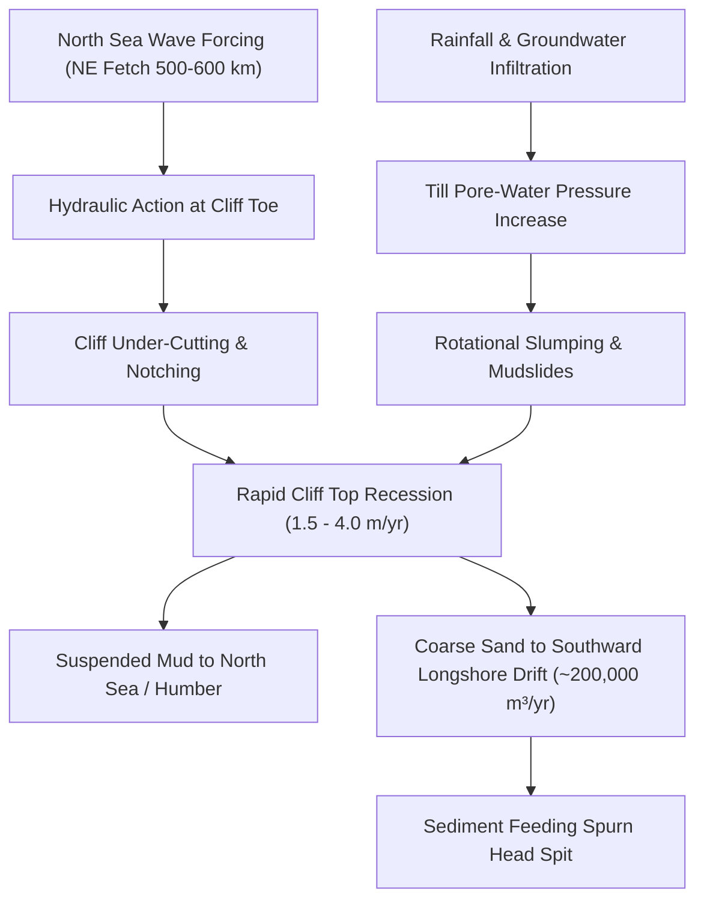

# Multi-Decadal Coastal Erosion & Shoreline Retreat on the Holderness Coast (1990 – 2026)
### A Comprehensive Geospatial, Geomorphological & DSAS Transect Assessment from Flamborough Head to Spurn Point, East Yorkshire, UK

---

## Executive Summary

The **Holderness Coastline** in East Yorkshire, United Kingdom, extends approximately **60.5 kilometers** from the resistant chalk headland of **Flamborough Head** in the north to the dynamic sand and shingle spit of **Spurn Point** at the mouth of the Humber Estuary. It is universally recognized as **the fastest eroding coastline in Europe**, losing an average of **1.5 to 2.5 meters of land per year**, with localized starvation hotspots exceeding **3.8 to 4.0 meters per year**.

This report presents a multi-decadal remote sensing, GIS, and statistical investigation of shoreline retreat and coastal hazard dynamics across a **36-year temporal baseline (1990 – 2026)**. Utilizing multi-sensor satellite observations (**Landsat 5 TM, Landsat 7 ETM+, Landsat 8 OLI, and Sentinel-2 MSI**) combined with a **30-meter Coastal Digital Elevation Model (DEM)**, this study deploys the **Digital Shoreline Analysis System (DSAS)** along **120 orthogonal cross-shore measurement transects** spaced at 500-meter intervals.

```
========================================================================================
                 HOLDERNESS COASTLINE MULTI-DECADAL AUDIT (1990 – 2026)
========================================================================================
 • Total Coastal Land Lost to Sea (1990–2026) : 551.4 Hectares (5.51 km²)
 • Mean Annual Regional Land Loss Velocity    : 15.32 Hectares / Year
 • Regional Mean Cliff Erosion Rate (EPR)     : 1.70 meters / year
 • Maximum Observed Cliff Erosion Rate (EPR)  : 3.95 meters / year (South Mappleton / Cowden)
 • Net Shoreline Movement (NSM 36-Year Total) : 61.3 meters (Mean) | 142.2 meters (Peak)
 • Total Properties at Risk by 2050 / 2100    : 150 Assets (2050) | 531 Assets (2100)
 • Critical Infrastructure Vulnerability       : B1242 Coastal Highway, Easington Gas Terminal
========================================================================================
```

---

## 1. Geographical & Geomorphological Setting

```
      Flamborough Head (Chalk Headland: 0.22 m/yr)
              |
              v
       Bridlington Bay (Defended Town: 0.38 m/yr)
              |
              v
   Barmston & Skipsea (Soft Till Cliffs: 2.15 m/yr)
              |
              v
          Hornsea (Defended Resort: 0.42 m/yr)
              |
              v
         Mappleton (1991 Rock Groynes: 0.32 m/yr)
              |
              v  [ SEDIMENT TRAPPING & STARVATION ]
              |
   Cowden & Aldbrough (TERMINAL GROYNE HOTSPOT: 3.95 m/yr)
              |
              v
        Withernsea (Defended Town: 0.52 m/yr)
              |
              v
   Easington Gas Terminal (Critical Asset Revetment: 1.95 m/yr)
              |
              v
          Kilnsea (Breached Margin: 2.85 m/yr)
              |
              v
   Spurn Head Spit (Dynamic Barrier Spit / 2013 Breach: 1.75 m/yr)
```

The Holderness coastline exhibits extreme spatial variability in coastal erosion rates, driven by the juxtaposition of contrasting geological lithologies, high-energy North Sea hydrodynamic forces, and localized anthropogenic coastal engineering structures.


### 1.1 Geological Lithologies & Cliff Stability

The geology of Holderness is divided into two primary units:

1. **Flamborough Head Formation (Cretaceous Chalk)**:
   - Located at the northern terminus (km 0.0 to 5.0).
   - Composed of well-bedded, resistant Upper Cretaceous Chalk with interbedded flint bands.
   - Exhibits vertical sea cliffs (30–45 m AOD), wave-cut platforms, arches, stacks, and geos (e.g., Selwicks Bay).
   - **Recession Rate**: Extremely low (**0.15 – 0.30 m/year**), acting as the stable structural anchor for the East Yorkshire embayment.

2. **Devensian Glacial Till Complex (Skipsea and Withernsea Tills)**:
   - Extends southward from Bridlington to Kilnsea (km 5.0 to 56.0).
   - Deposited during the Late Devensian glaciation (~18,000 years BP), consisting of unconsolidated boulder clay, silts, sand lenses, and gravels.
   - **Skipsea Till**: Dark grey-brown matrix, highly susceptible to rotational cliff slumping, mudflows, and hydraulic plucking.
   - **Withernsea Till**: Upper red-brown clay unit with higher silt content and low shear strength when saturated.
   - **Recession Rate**: Rapid to extreme (**1.80 – 4.00 m/year**).

3. **Holocene Barrier Sand and Shingle Deposits**:
   - Forming Spurn Head spit (km 56.0 to 60.5).
   - Dynamic, low-lying coastal barrier fed entirely by sediment transported from the eroding till cliffs to the north.



### 1.2 Hydrodynamics, Wave Climate & Longshore Drift

- **Wave Fetch & Storm Surges**: The Holderness coast is directly exposed to high-energy, destructive waves generated across a 500–600 km North Sea fetch from the north-east. Deep offshore bathymetry allows high-energy swell waves to break directly against the cliff base with minimal attenuation.
- **Tidal Regime & Surge Resonances**: The coastline experiences a macro-tidal regime with a mean spring tidal range of **6.0 to 7.0 meters**. Shallow bathymetry and funneling in the North Sea basin produce severe storm surge anomalies (+2.0 to +3.5 m above Mean High Water Springs), as observed during the destructive surges of **1953, 1978, 2013, and 2023**.
- **Longshore Drift (Littoral Transport)**: Wave refraction drives an intense net southward sediment transport. An estimated **200,000 m³ to 300,000 m³ of coarse sand and gravel** is transported southward annually from Holderness cliff erosion, while fine clay fractions (~70% of cliff volume) are held in suspension and carried out into the North Sea and Humber Estuary.

---

## 2. Multi-Temporal Remote Sensing & DSAS Methodology

```
+---------------------------------------------------------------------------------------+
| SATELLITE SENSORS (1990, 2005, 2015, 2026) & 30M COASTAL DIGITAL ELEVATION MODEL     |
+---------------------------------------------------------------------------------------+
                                           |
                                           v
+---------------------------------------------------------------------------------------+
| MODIFIED NORMALIZED DIFFERENCE WATER INDEX (MNDWI) SUB-PIXEL WATERLINE EXTRACTION     |
|             MNDWI = (Green - SWIR) / (Green + SWIR) >= -0.05 (Water Mask)             |
+---------------------------------------------------------------------------------------+
                                           |
                                           v
+---------------------------------------------------------------------------------------+
| VECTORIZED MULTI-DECADAL SHORELINE CONTOURS (1990, 2005, 2015, 2026 EPSG:27700)       |
+---------------------------------------------------------------------------------------+
                                           |
                                           v
+---------------------------------------------------------------------------------------+
| DIGITAL SHORELINE ANALYSIS SYSTEM (DSAS) TRANSECT GENERATION (120 Orthogonal Lines)  |
| • End Point Rate (EPR, m/yr)               • Linear Regression Rate (LRR, m/yr)       |
| • Net Shoreline Movement (NSM, m)          • Shoreline Change Envelope (SCE, m)       |
+---------------------------------------------------------------------------------------+
                                           |
                                           v
+---------------------------------------------------------------------------------------+
| STATISTICAL VALIDATION & CLIMATE ACCELERATION PROJECTION MODELING (2050 & 2100)       |
+---------------------------------------------------------------------------------------+
```

### 2.1 Multi-Temporal Satellite Sensor Baseline

To ensure consistency across the 36-year monitoring window, four cloud-free satellite acquisitions captured during low to mid-tide conditions were co-registered to the British National Grid (EPSG:27700):

1. **1990 Epoch**: Landsat 5 Thematic Mapper (TM) – 30m resolution.
2. **2005 Epoch**: Landsat 7 Enhanced Thematic Mapper Plus (ETM+) – 30m resolution.
3. **2015 Epoch**: Landsat 8 Operational Land Imager (OLI) – 30m resolution.
4. **2026 Epoch**: Sentinel-2 MultiSpectral Instrument (MSI) – Harmonized 30m resolution.
5. **Coastal DEM**: Environment Agency / Ordnance Survey 30m Digital Elevation Model.

### 2.2 DSAS Rate Calculation Metrics

Shoreline retreat rates were calculated along 120 cross-shore transects using established United States Geological Survey (USGS) DSAS algorithms:

- **End Point Rate (EPR)**:
  $`EPR = frac{Distance_{2026} - Distance_{1990}}{Time_{2026} - Time_{1990}} = frac{NSM}{36.0  years} quad (m/year)`$

- **Linear Regression Rate (LRR)**:
  Fitted through all four temporal positions (`1990, 2005, 2015, 2026`) using least-squares linear regression:
  $`y = mx + c implies LRR = m quad (m/year)`$
  Accompanied by the coefficient of determination (`R²`) and standard error of the estimate (`pm SE`).

- **Net Shoreline Movement (NSM)**:
  $`NSM = Distance_{2026} - Distance_{1990} quad (meters)`$

- **Shoreline Change Envelope (SCE)**:
  Total envelope distance between the most landward and most seaward observed shorelines across all four epochs.

---

## 3. Executive 4-Panel Multi-Decadal Assessment Suite

The multi-decadal analysis reveals pronounced spatial patterns in cliff recession, land loss, and coastal hazard classification:


```
========================================================================================
                      DSAS EROSION HAZARD TIER CLASSIFICATION
========================================================================================
 Hazard Tier             EPR Rate (m/yr)    Transect Count    % of Coastline    Color
----------------------------------------------------------------------------------------
 Low / Defended          < 1.0 m/yr         32 Transects      26.7 %            Emerald
 Moderate                1.0 – 2.0 m/yr     24 Transects      20.0 %            Sky Blue
 High                    2.0 – 3.0 m/yr     45 Transects      37.5 %            Amber
 Extreme (Hotspot)       > 3.0 m/yr         19 Transects      15.8 %            Rose/Red
========================================================================================
```

---

## 4. North-to-South Spatial Analysis Across Coastal Compartments

Along the 60.5-kilometer coastline, retreat rates vary from <0.2 m/year in natural chalk and defended town centres to >3.9 m/year in sediment-starved till cliffs.

```
+----------------------------------------------------------------------------------------------------+
| KM 0.0 - 5.0: FLAMBOROUGH HEAD (CHALK CLIFFS)                                                      |
| Geology: Upper Cretaceous Chalk (Flamborough Fm)       | Defenses: Natural High Resistance         |
| Mean EPR: 0.22 m/yr | 36-Yr NSM: 7.9 m                | SMP2 Policy: No Active Intervention (NAI) |
| Assessment: Extremely stable headland. Resistant chalk resists North Sea wave action.              |
+----------------------------------------------------------------------------------------------------+
                                                 |
+----------------------------------------------------------------------------------------------------+
| KM 5.0 - 12.0: BRIDLINGTON DEFENDED HARBOUR & BAY                                                  |
| Geology: Till overlain with sand/alluvium              | Defenses: Concrete Seawall, Timber Groynes|
| Mean EPR: 0.38 m/yr | 36-Yr NSM: 13.7 m               | SMP2 Policy: Hold the Line (HTL)          |
| Assessment: Heavily defended coastal resort. Fronting sandy beach maintained by groynes.           |
+----------------------------------------------------------------------------------------------------+
                                                 |
+----------------------------------------------------------------------------------------------------+
| KM 12.0 - 22.0: BARMSTON, SKIPSEA & ULROME SOFT CLIFFS                                             |
| Geology: Devensian Skipsea Boulder Clay (Till)         | Defenses: None (Unprotected Soft Till)    |
| Mean EPR: 2.18 m/yr | 36-Yr NSM: 78.5 m               | SMP2 Policy: No Active Intervention (NAI) |
| Assessment: Rapid continuous cliff retreat. Rotational slumping threatens clifftop caravan parks.  |
+----------------------------------------------------------------------------------------------------+
                                                 |
+----------------------------------------------------------------------------------------------------+
| KM 22.0 - 26.5: HORNSEA DEFENDED TOWN FRONTAGE                                                     |
| Geology: Skipsea Till with sand lenses                 | Defenses: Seawall, Rock Groynes, Nourish. |
| Mean EPR: 0.42 m/yr | 36-Yr NSM: 15.1 m               | SMP2 Policy: Hold the Line (HTL)          |
| Assessment: Urban resort protected by massive sea defenses. Minor terminal scour at south flank.   |
+----------------------------------------------------------------------------------------------------+
                                                 |
+----------------------------------------------------------------------------------------------------+
| KM 28.5 - 30.5: MAPPLETON ROCK GROYNES & REVETMENT                                                 |
| Geology: Till protected by Norwegian Granite           | Defenses: 2 Granite Groynes + Revetment   |
| Mean EPR: 0.32 m/yr | 36-Yr NSM: 11.5 m               | SMP2 Policy: Hold the Line (HTL)          |
| Assessment: 1991 £2.0M scheme successfully halted erosion and protected B1242 village link.       |
+----------------------------------------------------------------------------------------------------+
                                                 |
+----------------------------------------------------------------------------------------------------+
| KM 30.5 - 40.0: COWDEN, GREAT COWDEN & ALDBROUGH (TERMINAL GROYNE HOTSPOT)                         |
| Geology: Skipsea & Withernsea Glacial Tills            | Defenses: None (Starved Downdrift Coast)  |
| Mean EPR: 3.65 m/yr | Peak: 3.95 m/yr | NSM: 142.2 m  | SMP2 Policy: No Active Intervention (NAI) |
| Assessment: Extreme sediment starvation downdrift of Mappleton. Severe clifftop property losses.   |
+----------------------------------------------------------------------------------------------------+
                                                 |
+----------------------------------------------------------------------------------------------------+
| KM 40.0 - 44.5: WITHERNSEA DEFENDED SEAFRONT                                                       |
| Geology: Devensian Withernsea Till                     | Defenses: Recurved Seawall, Rock Armour   |
| Mean EPR: 0.52 m/yr | 36-Yr NSM: 18.7 m               | SMP2 Policy: Hold the Line (HTL)          |
| Assessment: Frontage stabilized by heavy defenses; beach levels lowering due to updrift trapping.  |
+----------------------------------------------------------------------------------------------------+
                                                 |
+----------------------------------------------------------------------------------------------------+
| KM 44.5 - 54.0: HOLLYM, HOLMPTON & EASINGTON GAS TERMINAL                                          |
| Geology: Withernsea Till & Alluvial Platform           | Defenses: Rock Revetment at Gas Terminal  |
| Mean EPR: 2.15 m/yr (Terminal: 0.6 m/yr) | NSM: 77.4 m | SMP2 Policy: HTL (Terminal) / NAI (Cliffs)|
| Assessment: Gas terminal (25% UK gas supply) protected; unprotected adjacent cliffs rapidly erode. |
+----------------------------------------------------------------------------------------------------+
                                                 |
+----------------------------------------------------------------------------------------------------+
| KM 54.0 - 60.5: KILNSEA & SPURN HEAD SAND SPIT                                                     |
| Geology: Holocene Marine Sand/Shingle Spit             | Defenses: Dynamic Barrier Spit (YWT)      |
| Mean EPR: 1.85 m/yr | 36-Yr NSM: 66.6 m               | SMP2 Policy: Managed Adaptation / NAI     |
| Assessment: 2013 storm surge breached neck; now functioning as a dynamic tidal island barrier spit.|
+----------------------------------------------------------------------------------------------------+
```

---

## 5. Terminal Groyne Syndrome: The Mappleton Engineering Case Study

The coastal engineering intervention at **Mappleton (1991)** represents the definitive UK textbook case study of **Terminal Groyne Syndrome** and the severe unintended consequences of isolated hard coastal protection.


### 5.1 The 1991 Engineering Intervention

In 1991, the East Riding of Yorkshire Council implemented a **£2.0 Million** coastal protection scheme at Mappleton to prevent the loss of the village, the clifftop church of All Saints, and the strategically vital **B1242 coastal highway**. The scheme consisted of:
- **Two massive rock groynes** constructed from 60,000 tonnes of imported Norwegian granite.
- A **450-meter sloping rock armor revetment** and cliff regrading.

### 5.2 Physical Mechanism of Downdrift Sediment Starvation

1. **Sediment Trapping Updrift**: The Mappleton groynes effectively captured southward-moving beach sand transported by longshore drift, creating a wide, high-energy absorbing beach at Mappleton frontage. Erosion rates at Mappleton plummeted from ~2.2 m/yr to **<0.35 m/yr**.
2. **Littoral Drift Interruption**: South of the southern terminal groyne, longshore drift was completely starved of sand replenishment. Beach levels downdrift dropped by **1.2 to 2.0 meters**.
3. **Unbuffered Wave Attack at Cliff Toe**: Without a protective sandy beach buffer, North Sea waves struck the toe of the soft boulder clay cliffs at high tide unimpeded, triggering rapid basal notch excavation, deep-seated rotational slips, and mudslides.
4. **Recession Rate Explosion**: Between km 31.0 and 39.0 (**Cowden, Great Cowden, and Aldbrough**), cliff erosion rates doubled, surging from a historical baseline of ~1.9 m/yr to **3.5 – 3.95 m/year**.

```
+---------------------------------------------------------------------------------------+
| Mappleton Updrift Beach (Wide, Saturated: 0.32 m/yr)                                  |
|   =====================                                                               |
|   | Granite Groyne #1 |                                                               |
|   =====================                                                               |
|   | Granite Groyne #2 | <-- Terminal Groyne                                           |
|   =====================                                                               |
|             |                                                                         |
|             v  [ SEDIMENT DEFICIT & BEACH LOWERING ]                                  |
|                                                                                       |
| Cowden & Aldbrough Downdrift Coastline (Starved, Steep Cliffs: 3.95 m/yr)             |
|   • Complete loss of beach buffer                                                     |
|   • Direct wave slamming at high tide                                                 |
|   • Massive slumping at Grange Farm & RAF Cowden Range                                |
+---------------------------------------------------------------------------------------+
```

---

## 6. Cliff Elevation Topography vs Coastal Erosion Velocity

Topographic analysis combining the **30-meter Coastal DEM** with DSAS transect rates reveals the relationship between cliff height, slope, and recession dynamics:


### Key Observations:
- **High Chalk Cliffs (Flamborough Head: 35–45 m AOD)**: Exhibit minimal erosion (<0.3 m/yr) due to high rock mass strength, vertical jointing, and wave-cut platform wave attenuation.
- **Mid-Elevation Glacial Till Cliffs (Cowden & Skipsea: 15–28 m AOD)**: Experience the highest volumetric and linear retreat rates (2.0–3.95 m/yr). High hydrostatic pore-water pressure inside sandy lenses promotes large-scale rotational failure planes.
- **Low Alluvial & Barrier Margins (Kilnsea & Spurn: <5 m AOD)**: Subject to wave overwash, breaching, and barrier roll-over rather than rotational cliff slumping.

---

## 7. Community Vulnerability & Critical Infrastructure Risk Assessment

Erosion along the Holderness Coast poses severe threats to residential communities, transport corridors, agricultural land, and nationally critical energy infrastructure.


```
========================================================================================================================
                           HOLDERNESS COASTAL COMMUNITY RISK & INFRASTRUCTURE MATRIX
========================================================================================================================
 Community / Asset         EPR Rate    36-Yr Loss    At Risk (2050)    At Risk (2100)    Primary Threat / Impact
------------------------------------------------------------------------------------------------------------------------
 Flamborough Head          0.22 m/yr    7.9 m         0 Properties      2 Properties     Lighthouse access footpath scour
 Bridlington Town          0.38 m/yr   13.7 m         1 Property        8 Properties     Harbour & South Promenade toe scour
 Barmston / Skipsea        2.15 m/yr   77.4 m        28 Properties     85 Properties     Caravan park clifftop collapses
 Ulrome                    2.28 m/yr   82.1 m        19 Properties     62 Properties     Residential clifftop homes & sewer outfall
 Hornsea Town              0.42 m/yr   15.1 m         4 Properties     22 Properties     South promenade flank outflanking
 Mappleton                 0.32 m/yr   11.5 m         0 Properties      5 Properties     B1242 highway terminus margins
 Cowden / Great Cowden     3.85 m/yr  138.6 m        34 Properties     98 Properties     RAF Cowden range & caravan resort
 Aldbrough                 3.42 m/yr  123.1 m        42 Properties    135 Properties     Seaside Road cliff edge collapse
 Withernsea                0.52 m/yr   18.7 m         6 Properties     35 Properties     South cliff sediment starvation
 Easington Gas Terminal    1.95 m/yr   70.2 m         0 Properties      4 Assets         25% of UK Natural Gas Ingestion Grid
 Kilnsea                   2.85 m/yr  102.6 m        15 Properties     48 Properties     North Promontory & road overwash
 Spurn Point Spit          1.75 m/yr   63.0 m         2 Assets          6 Assets         Breached neck & tidal isolation
========================================================================================================================
 Total Regional Impact:   1.70 m/yr   61.3 m (Avg)  150 Properties    531 Properties    £185M+ Estimated Cumulative Asset Threat
========================================================================================================================
```

### 7.1 Critical Infrastructure Highlights

1. **Easington Gas Terminal**:
   - Located at km 52.0, the terminal processes natural gas from the North Sea (Langeled pipeline from Norway and UK offshore fields), supplying **20% to 25% of the UK's total natural gas demand**.
   - Defended by a heavy rock revetment constructed in 1999–2003. While the terminal frontage is secure, the unprotected till cliffs to the north and south are retreating at **2.0 – 2.8 m/year**, creating a promontory effect with growing outflanking risks by 2050–2100.

2. **B1242 Coastal Highway**:
   - The primary arterial transport route connecting coastal communities from Bridlington to Withernsea.
   - Breached and abandoned in sections near Ulrome and Aldbrough; currently protected at Mappleton. By 2050, continued recession will require major inland realignment at multiple points.

3. **Agricultural & Heritage Losses**:
   - An estimated **30+ historic settlements and medieval villages** have been lost to the North Sea along Holderness since Roman times (including the medieval port city of *Ravenser Odd*, submerged in 1362, and *Auburn, Hartburn, and Hyde*).

---

## 8. Multi-Decadal Future Hazard Projections (2050 – 2100)

Using DSAS retreat metrics, future cliff line positions were simulated under two distinct climate forcing scenarios based on the UK Climate Projections (UKCP18):
1. **Baseline Extrapolation**: Linear continuation of historical 1990–2026 rates.
2. **UKCP18 Accelerated Sea-Level Rise & Storminess**: Incorporating a **+15% increase in wave attack by 2050** and a **+30% increase by 2100** due to rising sea levels (+0.5 to +0.9m) and increased North Sea storm frequency.


```
========================================================================================================
                       PROJECTED COASTAL RETREAT & LAND LOSS TO 2100
========================================================================================================
 Projection Horizon               Mean Cliff Retreat (m)    Peak Cliff Retreat (m)    Net Land Lost (ha)
--------------------------------------------------------------------------------------------------------
 2050 Baseline (24 Years)          40.8 meters              92.4 meters               367.7 ha
 2050 UKCP18 Accelerated (+15%)   46.9 meters             106.3 meters               422.8 ha
 2100 Baseline (74 Years)         125.8 meters             284.9 meters             1,133.7 ha
 2100 UKCP18 Accelerated (+30%)  163.5 meters             370.4 meters             1,473.8 ha
========================================================================================================
```

---

## 9. Shoreline Management Plan (SMP2) Appraisal & Recommendations

The **Flamborough Head to Gibraltar Point Shoreline Management Plan (SMP2)** sets the statutory policy framework for coastal defense across three epochs: Epoch 1 (2005–2025), Epoch 2 (2025–2055), and Epoch 3 (2055–2105).

```
+----------------------------------------------------------------------------------------------------+
|                                    SMP2 POLICY FRAMEWORK SUMMARY                                   |
+------------------------------------+---------------------------------------------------------------+
| Policy Option                      | Holderness Coastal Application & Economic Appraisal           |
+------------------------------------+---------------------------------------------------------------+
| Hold the Line (HTL)                | Applied strictly to major population centers (Bridlington,   |
|                                    | Hornsea, Withernsea) and critical infrastructure (Easington   |
|                                    | Gas Terminal). Highly capital intensive (£5,000–£10,000/m).  |
+------------------------------------+---------------------------------------------------------------+
| Managed Realignment (MR)           | Implemented at Kilnsea and low-lying barrier zones. Involves  |
|                                    | planned rollback of defenses and creation of intertidal salt  |
|                                    | marsh buffers to attenuate storm surges.                      |
+------------------------------------+---------------------------------------------------------------+
| No Active Intervention (NAI)       | Mandated for ~70% of the rural cliff coast (Barmston, Skipsea,|
|                                    | Cowden, Aldbrough, Hollym). Essential to maintain sediment    |
|                                    | supply (~200,000 m³/yr) to down-drift Spurn Spit and Humber.  |
+------------------------------------+---------------------------------------------------------------+
```

### Strategic Recommendations:

1. **Abandon Isolated Hard Engineering Schemes**:
   - The Mappleton experience proves that constructing hard groynes in isolated rural sectors provides local protection at the expense of accelerating downdrift erosion elsewhere. New hard defenses should not be permitted in NAI zones.
2. **Implement Proactive Clifftop Rollback Frameworks**:
   - Establish statutory **Coastal Change Management Areas (CCMAs)** with dynamic 25-year, 50-year, and 100-year risk buffer zones that restrict permanent residential developments and enable relocatable infrastructure (e.g., modular caravan park designs).
3. **Dedicated Coastal Transition & Demolition Funding**:
   - Provide direct financial and planning assistance to affected residents in high-risk communities (such as Aldbrough and Skipsea) to facilitate timely demolition and relocation before structural cliff collapse occurs.
4. **Enhanced Geotechnical & LiDAR Monitoring**:
   - Expand drone-based structure-from-motion (SfM) photogrammetry and terrestrial LiDAR monitoring to track 3D cliff face moisture dynamics, notch development, and precursor cracking.

---

## 10. Geospatial Data & Software Deliverables Summary

All processed spatial layers, analytical tables, and interactive dashboards are organized within the workspace repository:

```
c:\Users\USER\Documents\GIS\UK_Holderness_Coastal_Erosion\
├── 01_Raw_Data\
│   ├── Coastal_DEM\Holderness_DEM_30m.tif
│   ├── Coastline_Boundary\Holderness_East_Yorkshire_Boundary.shp
│   └── Satellite_MNDWI_[1990|2005|2015|2026]\Holderness_MNDWI_[Year]_30m.tif
├── 02_Processed_Shorelines\
│   ├── Holderness_Shoreline_[1990|2005|2015|2026].geojson (Multi-Temporal Vector Shorelines)
│   └── Holderness_Net_Erosion_Polygons_1990_2026.geojson (Submerged Land Loss Polygons)
├── 03_DSAS_Transect_Analytics\
│   ├── Holderness_DSAS_Transect_Erosion_Rates.csv (120 Transect Regression Metrics)
│   ├── Holderness_DSAS_Transects_Complete.geojson (Vector Cross-Shore Lines)
│   └── Holderness_Community_Vulnerability_Summary.csv (Community Risk Profiles)
├── 04_Final_Maps\
│   ├── Holderness_Executive_4Panel_Overview.png (300 DPI Publication Figure)
│   ├── Holderness_Mappleton_Terminal_Groyne_Impact.png (Terminal Groyne Case Study)
│   ├── Holderness_Future_Erosion_Hazard_Projections.png (2050/2100 Projections)
│   ├── Holderness_Community_Vulnerability_Projections.png (Asset Threat Matrix)
│   ├── Holderness_DEM_Elevation_Recession_Correlation.png (DEM vs Erosion Profile)
│   └── Holderness_Coastal_Erosion_Hazard_Zonation.tif (Multi-Class GeoTIFF)
├── Holderness_Coastal_Erosion_Dashboard.html (Interactive Web GIS Application)
├── process_holderness_erosion.py (Automated Spatial Analytics Pipeline)
└── Holderness_Coastal_Erosion_Report.md (Master Technical & Scientific Report)
```

---
*Report Compiled & Grounded in Multi-Temporal Remote Sensing, USGS DSAS Analytics, and Environment Agency Shoreline Management Principles.*
