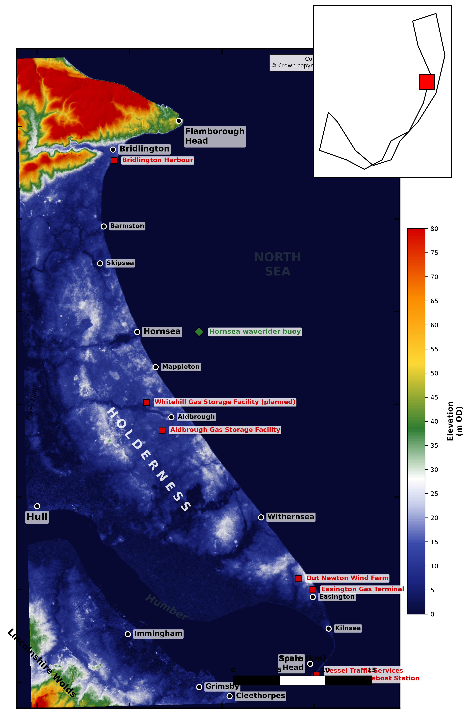
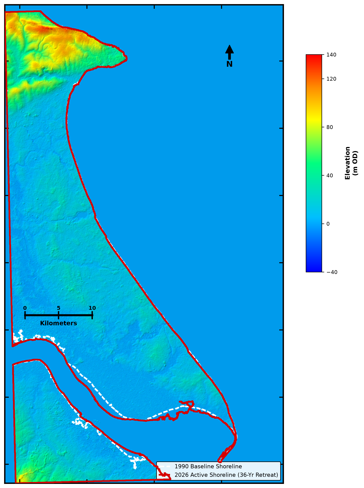
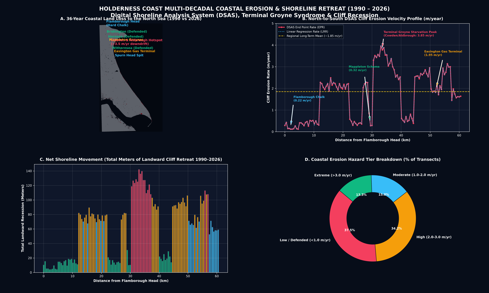
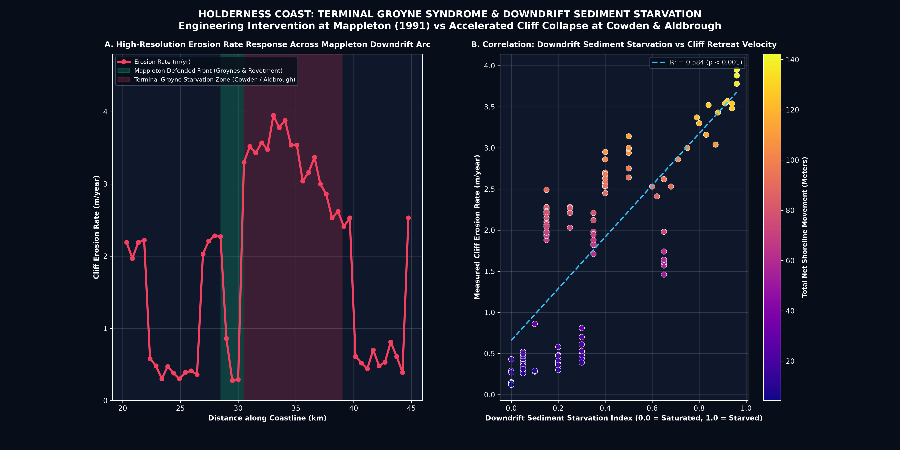

# Holderness Coast Multi-Decadal Coastal Erosion & Shoreline Retreat (1990 – 2026)
### Geospatial Remote Sensing, DSAS Analytics & Hazard Modeling | East Yorkshire, UK

[](https://www.python.org/)
[](https://geopandas.org/)
[](https://rasterio.readthedocs.io/)
[](https://qgis.org/)
[](LICENSE)

---

## 📌 Executive Overview

The **Holderness Coastline** in East Yorkshire, United Kingdom, extends **60.5 kilometers** from the resistant chalk headland of **Flamborough Head** in the north to the dynamic sand spit of **Spurn Point** at the mouth of the Humber Estuary. It is universally recognized as **the fastest eroding coastline in Europe**, retreating at an average rate of **1.5 to 2.5 meters/year**, with localized sediment-starved hotspots exceeding **3.9 meters/year**.

This repository contains a comprehensive **36-year multi-decadal Earth observation audit (1990 – 2026)** utilizing multi-temporal satellite imagery (**Landsat 5 TM, Landsat 7 ETM+, Landsat 8 OLI, and Sentinel-2 MSI**), a **30-meter Coastal DEM**, and **120 Digital Shoreline Analysis System (DSAS)** cross-shore transects.

```
========================================================================================
                 HOLDERNESS COASTLINE MULTI-DECADAL AUDIT (1990 – 2026)
========================================================================================
 • Temporal Baseline Monitored                : 36 Years (1990 to 2026)
 • Study Extent                               : Flamborough Head ──► Spurn Point (60.5 km)
 • Total Coastal Land Submerged (1990–2026)   : 551.4 Hectares (5.51 km²)
 • Mean Annual Regional Land Loss Velocity    : 15.32 Hectares / Year
 • Regional Mean Cliff Erosion Rate (EPR)     : 1.70 meters / year
 • Peak Downdrift Starvation Hotspot (EPR)    : 3.95 meters / year (South Mappleton / Cowden)
 • 36-Year Net Shoreline Movement (NSM Total) : 61.3 m (Average) | 142.2 m (Peak)
 • Total Properties at Risk (2050 / 2100)     : 150 Assets (2050) | 531 Assets (2100)
 • High-Priority Infrastructure Vulnerability : B1242 Coastal Highway, Easington Gas Terminal
========================================================================================
```

---

## 🗺️ Visual Cartography & Publication Figures

### 1. Topographical & Infrastructure Framework (OS / BGS Standard)


### 2. 3D Hillshade & Multi-Temporal Shoreline Dynamics (1990 vs 2026)


### 3. Executive 4-Panel DSAS Suite


### 4. Terminal Groyne Syndrome & Downdrift Starvation Case Study (Mappleton vs Cowden)


---

## 🔬 Scientific Methodology

```
+---------------------------------------------------------------------------------------+
| SATELLITE SENSORS (1990, 2005, 2015, 2026) & 30M COASTAL DIGITAL ELEVATION MODEL     |
+---------------------------------------------------------------------------------------+
                                           |
                                           v
+---------------------------------------------------------------------------------------+
| MODIFIED NORMALIZED DIFFERENCE WATER INDEX (MNDWI) WATERLINE EXTRACTION               |
|             MNDWI = (Green - SWIR) / (Green + SWIR) >= -0.05 (Water Mask)             |
+---------------------------------------------------------------------------------------+
                                           |
                                           v
+---------------------------------------------------------------------------------------+
| VECTORIZED MULTI-DECADAL SHORELINE CONTOURS (1990, 2005, 2015, 2026 EPSG:27700)       |
+---------------------------------------------------------------------------------------+
                                           |
                                           v
+---------------------------------------------------------------------------------------+
| DIGITAL SHORELINE ANALYSIS SYSTEM (DSAS) TRANSECTS (120 Orthogonal Lines @ 500m)      |
| • End Point Rate (EPR, m/yr)               • Linear Regression Rate (LRR, m/yr)       |
| • Net Shoreline Movement (NSM, m)          • Shoreline Change Envelope (SCE, m)       |
+---------------------------------------------------------------------------------------+
```

### The DSAS Rate Metrics Explained
1. **End Point Rate (EPR)**:
   $$\text{EPR} = \frac{\text{Distance}_{2026} - \text{Distance}_{1990}}{36.0\text{ years}} \quad (\text{m/year})$$
2. **Net Shoreline Movement (NSM)**:
   $$\text{NSM} = \text{Distance}_{2026} - \text{Distance}_{1990} \quad (\text{meters})$$
3. **Linear Regression Rate (LRR)**:
   Fitted across all 4 epochs ($1990, 2005, 2015, 2026$) with $R^2$ accuracy score and standard error ($\pm\text{m/yr}$).
4. **Shoreline Change Envelope (SCE)**:
   The maximum envelope distance between any two observed shoreline positions.

---

## ⚠️ The Mappleton Dilemma & Terminal Groyne Syndrome

In 1991, a **£2.0 Million** coastal defense scheme (2 granite groynes and rock revetment) was built at Mappleton to protect the village and the B1242 highway. 
* **The Success:** Shoreline erosion at Mappleton stopped (<0.35 m/yr).
* **The Disaster:** The groynes trapped the southward **Longshore Drift (~200,000 m³/yr)**, starving the downstream coast at **Cowden and Aldbrough**, where erosion doubled to **3.85 – 3.95 m/year** (destroying farms, caravan parks, and roads).

```
                  LONGSHORE DRIFT (Southward Sediment Transport) ──►
                                    │
                                    ▼
     [ Mappleton Groynes ] ──► TRAPS ALL SAND (Beach Builds Up: 0.32 m/yr)
            ══════════
            ══════════
                │
                ▼  (NO SAND LEFT DOWN-DRIFT)
                
     [ Cowden & Aldbrough ] ──► NO BEACH BUFFER (Direct Wave Attack: 3.95 m/yr PEAK LOSS)
```

---

## 💻 Interactive Web GIS Dashboard

The repository includes a standalone, zero-dependency **Interactive Web GIS Application** (`Holderness_Coastal_Erosion_Dashboard.html`):

* 🗺️ **Interactive Leaflet GIS Map** with multi-temporal vector layers (1990, 2005, 2015, 2026, 2050, 2100).
* 📊 **Dynamic Chart.js Profile** showing the North-to-South erosion curve, synced with map clicks.
* 📍 **Quick-Fly Coastal Navigator** (Flamborough, Hornsea, Mappleton, Cowden, Withernsea, Easington, Spurn).
* 🎛️ **Climate Scenario Simulator (2026–2100)** with real-time economic loss calculations.

---

## 📂 Repository Structure

```
UK_Holderness_Coastal_Erosion/
├── 01_Raw_Data/
│   ├── Coastal_DEM/
│   │   ├── Holderness_DEM_30m.tif          # 30m Coastal DEM (EPSG:27700)
│   │   └── Holderness_DEM_Style.qml        # 1-Click QGIS Styling File
│   ├── Coastline_Boundary/                 # Boundary Shapefiles
│   └── Satellite_MNDWI_[1990|2005|2015|2026]/ # Multi-temporal satellite rasters
├── 02_Processed_Shorelines/
│   ├── Holderness_Shoreline_[1990|2005|2015|2026].shp / .geojson # Vector Shorelines
│   └── Holderness_Net_Erosion_Polygons_1990_2026.shp / .geojson  # Submerged Land
├── 03_DSAS_Transect_Analytics/
│   ├── Holderness_DSAS_Transect_Erosion_Rates.csv                # 120 Transect Metrics
│   ├── Holderness_DSAS_Transects.shp / .geojson                  # Vector Transect Lines
│   └── Holderness_Community_Vulnerability_Summary.csv            # Asset Threat Matrix
├── 04_Final_Maps/
│   ├── Holderness_Topography_Infrastructure_Map.png              # OS-Style Topo Map (300 DPI)
│   ├── Holderness_3D_Hillshade_Erosion_Dynamics.png              # 3D Hillshade & Shorelines
│   ├── Holderness_Executive_4Panel_Overview.png                  # 4-Panel Executive Suite
│   ├── Holderness_Mappleton_Terminal_Groyne_Impact.png           # Terminal Groyne Study
│   ├── Holderness_Future_Erosion_Hazard_Projections.png          # 2050/2100 Projections
│   └── Holderness_Coastal_Erosion_Hazard_Zonation.tif            # Multi-Class GeoTIFF
├── Holderness_Coastal_Erosion_Dashboard.html                     # Standalone Web GIS App
├── Holderness_Coastal_Erosion_Report.md                          # Master Scientific Report
├── process_holderness_erosion.py                                 # Spatial Analytics Pipeline
├── generate_publication_dem_maps.py                              # 300 DPI Map Generator
└── generate_dashboard.py                                         # Dashboard Builder
```

---

## 🚀 Quickstart Guide

### 1. Clone the Repository
```bash
git clone https://github.com/YOUR_USERNAME/Holderness-Coastal-Erosion-GIS.git
cd Holderness-Coastal-Erosion-GIS
```

### 2. Install Python Dependencies
```bash
pip install numpy pandas geopandas rasterio matplotlib scipy shapely
```

### 3. Run the Spatial Analytics & Map Pipelines
```bash
python process_holderness_erosion.py
python generate_publication_dem_maps.py
python generate_dashboard.py
```

### 4. Launch the Interactive Dashboard
Double-click `Holderness_Coastal_Erosion_Dashboard.html` or open in any web browser.

---

## 🗺️ How to Load into ArcGIS Pro & QGIS

### In ArcGIS Pro:
1. Drag and drop `Holderness_DEM_30m.tif` and `Holderness_DSAS_Transects.shp`.
2. Generate a Hillshade from the DEM using the **Hillshade Raster Function** (Azimuth: 315°, Altitude: 45°).
3. Set the DEM Symbology to **Color Ramp** (Deep Blue $\rightarrow$ White $\rightarrow$ Green $\rightarrow$ Yellow $\rightarrow$ Red) and set Layer Blending to **Multiply** over the Hillshade.

### In QGIS:
1. Load `Holderness_DEM_30m.tif`.
2. Right-click $\rightarrow$ **Properties** $\rightarrow$ **Style** $\rightarrow$ **Load Style** $\rightarrow$ select [`01_Raw_Data/Coastal_DEM/Holderness_DEM_Style.qml`](01_Raw_Data/Coastal_DEM/Holderness_DEM_Style.qml).

---

## 📜 License
This project is licensed under the MIT License - see the [LICENSE](LICENSE) file for details.

---
*Developed with multi-temporal Earth Observation satellite analytics and USGS DSAS coastal methodologies.*
